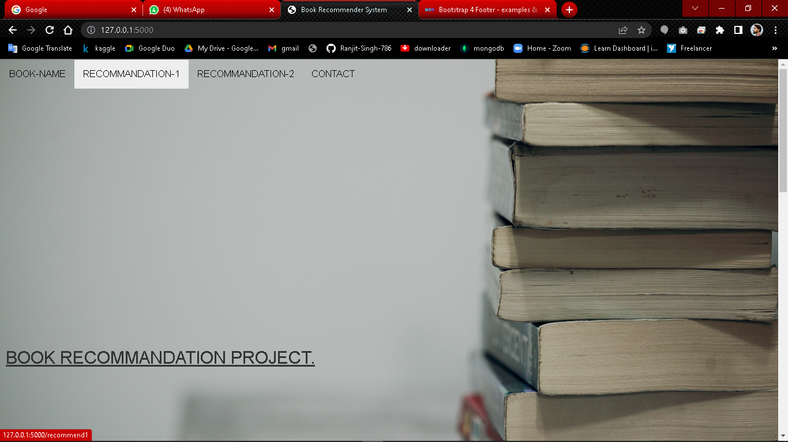
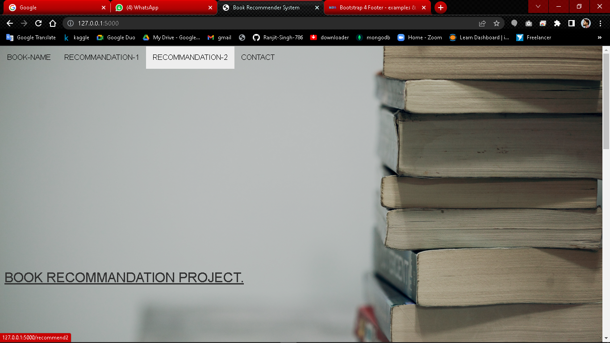
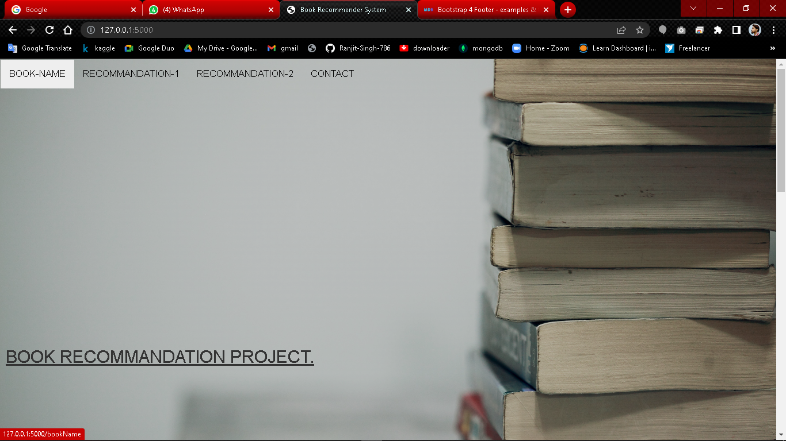
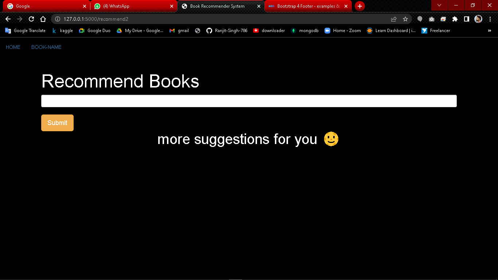

# Book-Recommedation_Project
in this project, i build three kind of Recommandation System are :
<ul>
<li>popularity based filtering</li>
<li>content based filtering </li>
<li>collaborative based filtering </li>
</ul>
## Recommandation Systems
It predicts the user’s interests and recommends products to the users that will  engage their attention. These are quite effective machine learning mechanisms that have helped businesses gain more revenue.
### To install all Dependencies for this project execute this command. 
""" pip install -r requirements.txt """

### steps to execute this project
<ul>
    <li>clone this project.</li>
    <li>go inside the current working directory.</li>
    <li>open the command prompt at this location.</li>
    <li>execute the "python app.py"</li>
    <li>get the linc and past on your browser.</li>
</ul>

### click on the RECOMMANDATION-1 button to SEE popularity based filtering recommanded books.

### click on the RECOMMANDATION-2 button to SEE collaborative based filtering recommanded books.

### click on the BOOK-NAME button to SEE 574 famous books Name.

### write books Name in input section and click on the submit button to get recommandation.

##Thank you 🌝
